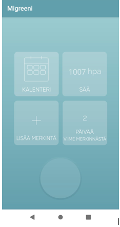
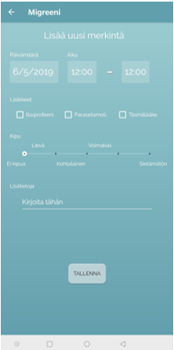
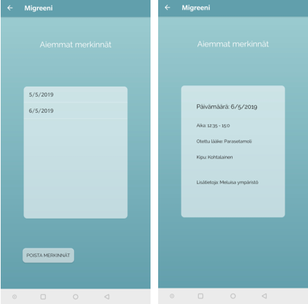
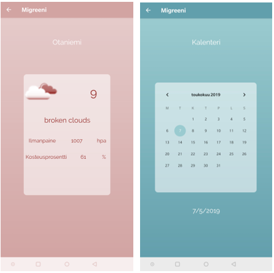

# Migreeni_app
<h2>Migreenipäiväkirja</h2>

Migreenin seurantaan tarkoitettu mobiilisovellus, jossa käyttäjä voi tallentaa ja tarkastella kohtauksiaan. Sovellusta voitaisiin käyttää myös migreenin diagnoosin tekemiseen.

  
 

Mikä on migreeni?

Migreeni on aivorungossa syntyvä, päänsärkykohtauksia aiheuttava sairaus. Migreenistä arvioidaan kärsivän noin 10% väestöstä, tämän lisäksi migreenistä kärsii moni ilman virallista diagnoosia. Pahimmillaan migreeni on elämää rajoittava ja elämänlaatua heikentävä sairaus.

Elämäntavoilla ei tiedetä olevan yhteyttä migreeniin sairastumiseen, eikä taipumusta siihen voida ehkäistä. Migreeni on yksilöllinen sairaus ja kohtausten muoto voi vaihdella sen aiheuttamasta syystä riippuen. Oman migreeninsä aiheuttavien tekijöiden tunnistamisesta voi olla merkittävä hyöty, tällöin kohtaukselta voi parhaassa tapauksessa välttyä.

Migreenikohtauksen kulku voidaan jakaa neljään osaan: esioireisiin, auraan (10-15% esiintyvyys), särkyvaiheeseen ja siihen liittyviin muihin oireisiin sekä jälkioireisiin.

 

Migreenikohtauksen mahdollisia laukaisijoita:

stressi tai sen laukeaminen, hormonaaliset tekijät, verensokerin lasku ts. pitkät ruokailuvälit, niska- ja hartiaseudun jännitystilat, voimakkaat valot, voimakkaat hajut, lämpötilan ja sään huomattavat vaihtelut, ilmanpaine, vuorokausirytmin muutokset, valvominen, alkoholi, tietyt ruoka-aineet, heikko näkö, purentavirheet

Usein migreenikohtaus alkaa ilman esioireita, mahdollisia oireita voivat kuitenkin olla:

haukottelu, väsymys, mieliteot, mielialan muutokset, aura, puheentuoton häiriö, halvausoire

Migreenin hoidossa tärkeintä on tunnistaa laukaisevat tekijät ja mahdollisuuksien mukaan välttää niitä. Myös lepo on tärkeää kohtauksen aikana, jolloin myös lääkitys tehoaa nopeammin. Lääkityksenä voidaan käyttää yhtä tai useampia seuraavista: tulehduskipulääke, yhdistelmävalmiste, triptaani tai ergotamiini-johdannainen, myös pahoinvointilääke näiden rinnalla voi tulla kyseeseen.

Lähteet: 
https://www.terve.fi/artikkelit/migreenin-syntymekanismi
https://www.terveyskirjasto.fi/terveyskirjasto/tk.koti?p_artikkeli=dlk00047
https://www.hs.fi/kotimaa/art-2000005824588.html
https://migreeni.org/paansarkysairaudet/migreeni/
https://www.yths.fi/terveystieto_ja_tutkimus/terveystietopankki/119/paansarky_-_migreeni_ja_muut_yleisimmat_paansaryt

<h3>SOVELLUS</h3>

Yllä mainitut tiedot huomioiden migreeniin seurantaan suunniteltu sovellus on perustellusti hyödyllinen projekti, jolle löytyy käyttäjäkuntaa niin migreeniä sairastavista kuin migreeniä itsellään epäilevistä. Jälkimmäinen ryhmä hyötyy sovelluksesta erityisesti diagnosoinnin apuna, sillä useimmiten tähän käytetään oirepäiväkirjaa apuna; diagnoosi voidaan tehdä, mikäli migreenikohtauksia on ollut viisi, tai aurallisia migreenikohtauksia kaksi.

Sovelluksella haluamme tarjota käyttäjälle mahdollisuuden pitää päiväkirjaa migreenikohtauksien esiintymisistä ja niihin vaikuttaneista tekijöistä sekä oireiden luonteesta. Sovellus suunnitellaan mahdolliseksi käyttää käyttäjän kulloisessakin sijainnissa ja tilanteessa kuin tilanteessa; migreenikohtauksen alkaessa ei oireista kärsivältä voi odottaa kykyä täyttää kaavakkeita tilastaan, joten päänsäryn alun merkkaus tehdään mahdollisimman vaivattomaksi: yhden napin painalluksesta. Puhelimen käyttö ei kuitenkaan aina tule kohtauksen sattuessa kyseeseen ollenkaan, joten kirjaukset tehdään mahdolliseksi lisätä myöhemminkin, myös täydentäviä tietoja voidaan merkitä jälkikäteen.

Täten sovellukseen voidaan merkitä ja siitä voidaan tarkastella migreenikohtauksen alkamisajankohta, päättymisajankohta, vaikuttaneet laukaisijat ja esioireet. Sovellukseen harkitaan mahdolliseksi merkitä myös otetut lääkkeet, jonka avulla käyttäjä voi arvioida niiden vaikuttavuutta. Sovellukseen tuodaan myös reaaliaikaiset säätiedot, jolloin käyttäjä voi arvioida ympäristön tekijöiden vaikutusta olotilaansa, esim. ilmanpaine.

Lääkinnällisen laitteen statuksella voisi mahdollistaa sovelluksen uskottavan käytön terveydenhuollossa, yhdistäen sen esimerkiksi sairaanhoidon järjestelmiin, jolloin data voitaisiin lähettää puhelimesta suoraan potilastietoihin.
